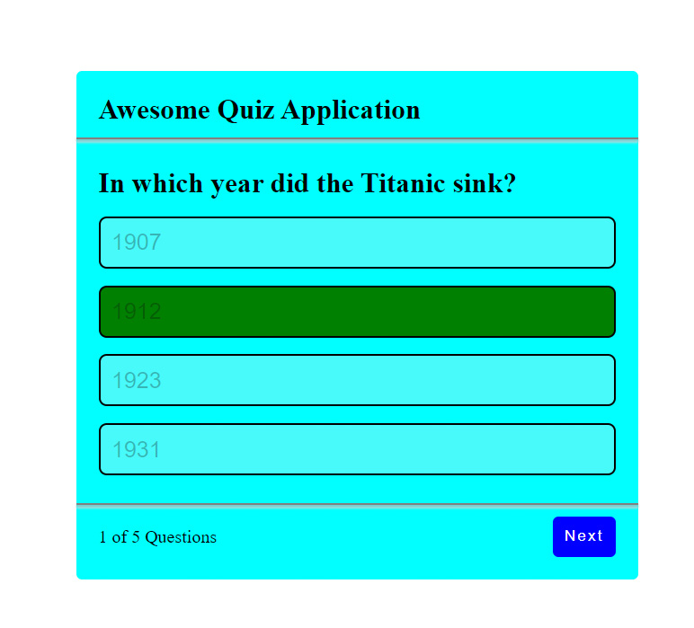

# Quiz App

This repository contains a simple quiz application built with HTML, CSS, and JavaScript. The quiz app presents a set of quiz questions and evaluates user responses to calculate their score.

 

# Try Demo
You can try by clicking [HERE](https://narekhar666.github.io/Quiz-app/).

## Features

- Questions and answer options are defined in a structured JavaScript array.
- Questions are randomized for each quiz session.
- Users can select an answer to a question.
- The app provides immediate feedback on the correctness of the answer.
- At the end of the quiz, the user's score is displayed.
- Users can choose to play the quiz again or quit.

## Code Explanation

- The quiz questions are defined in the `questions` array as JavaScript objects.
- The `startQuiz` function initializes the quiz and randomizes the questions.
- Users can select an answer, and the `select` function handles the feedback and scoring.
- The app keeps track of the user's score and the current question index.
- The `showResult` function displays the final score at the end of the quiz.

## Author
Narek Harutyunyan

Happy quizzing! 
Feel free to use